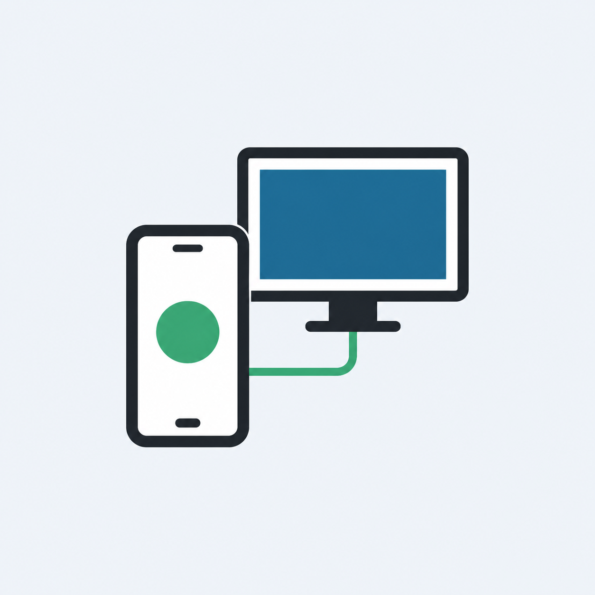

<div align="center">
  

  # PC to Mobile

  Phản chiếu và điều khiển điện thoại Android trên Windows qua USB hoặc Wi‑Fi.

  [](https://github.com/lestmegogo/Screenpcmobile/actions/workflows/windows-release.yml)
  [](https://github.com/lestmegogo/Screenpcmobile/releases/latest)
</div>

## Tính năng

- Hiển thị và điều khiển Android bằng chuột, bàn phím.
- Kết nối qua USB hoặc Wireless Debugging.
- Ghép đôi Wi‑Fi bằng mã QR hoặc mã sáu số.
- Truyền âm thanh trên Android 11 trở lên.
- Điều chỉnh độ phân giải, FPS và bitrate.
- Tắt màn hình điện thoại, giữ thiết bị thức và ghi lại phiên điều khiển.
- Tự đóng phiên và xóa thiết bị khỏi danh sách khi mất kết nối.
- Không cần root, không cần cài ứng dụng phụ trên điện thoại.

> PC to Mobile hiện chỉ hỗ trợ Android. iPhone có thể phản chiếu qua AirPlay,
> nhưng iOS không cho phép ứng dụng Windows điều khiển toàn bộ thiết bị như
> scrcpy.

## Tải và cài đặt

Tải phiên bản mới nhất tại
[GitHub Releases](https://github.com/lestmegogo/Screenpcmobile/releases/latest).

### Bộ cài Windows

1. Tải `PCToMobile-Setup-v1.1.0.exe`.
2. Mở file và chờ quá trình cài đặt hoàn tất.
3. Khởi động **PC to Mobile** từ Desktop hoặc Start Menu.

Bộ cài đã chứa .NET Runtime, ADB và scrcpy. Máy đích không cần cài thêm
thành phần nào. Ứng dụng được cài riêng cho tài khoản Windows hiện tại tại:

```text
%LOCALAPPDATA%\Programs\PCToMobile
```

Để gỡ ứng dụng, mở **Settings > Apps > Installed apps > PC to Mobile**.

Windows có thể hiển thị cảnh báo SmartScreen vì bộ cài chưa được ký bằng
chứng thư thương mại. Hãy chỉ tải file từ trang Releases của repository này.

### Bản portable

1. Tải `PCToMobile-v1.1.0-win-x64.zip`.
2. Giải nén toàn bộ file ZIP.
3. Mở `PCToMobile.exe`.

Không di chuyển riêng file EXE ra khỏi thư mục đã giải nén. ADB, scrcpy và
các thư viện cần thiết nằm trong thư mục `tools`.

## Kết nối Android

### USB

1. Trên điện thoại, bật **Developer options** và **USB debugging**.
2. Cắm cáp USB.
3. Mở khóa điện thoại và chấp nhận yêu cầu cấp quyền ADB.
4. Chọn thiết bị trong PC to Mobile và nhấn **Mở màn hình**.

### Wi‑Fi — Android 11 trở lên

1. Mở **Developer options > Wireless debugging**.
2. Trong tab **Wi‑Fi** của PC to Mobile, nhấn **Tạo mã QR**.
3. Trên điện thoại, chọn **Pair device with QR code** và quét mã.
4. Chọn thiết bị Wi‑Fi vừa xuất hiện và nhấn **Mở màn hình**.

Bạn cũng có thể dùng **Pair device with pairing code**, sau đó nhập địa chỉ,
cổng và mã sáu số vào phần **Ghép đôi bằng mã**.

### ADB TCP/IP truyền thống

Kết nối USB và bật ADB TCP/IP trước, sau đó nhập
`địa-chỉ-IP:5555` trong phần **Kết nối trực tiếp**.

## Cấu hình đề xuất

| Kết nối | Độ phân giải | FPS | Bitrate |
|---|---:|---:|---:|
| USB | 1920 px | 60 | 8–12M |
| Wi‑Fi ổn định | 1280 px | 45–60 | 4–6M |
| Wi‑Fi yếu | 1024 px | 30 | 2–4M |

Nếu kết nối Wi‑Fi bị khựng, hãy dùng mạng 5 GHz, đưa điện thoại gần router,
giảm bitrate và tắt truyền âm thanh khi không cần.

## Xử lý sự cố

- **Chờ cấp quyền:** mở khóa điện thoại và chọn
  **Always allow from this computer**.
- **Offline:** rút cáp, tắt/bật USB debugging rồi kết nối lại.
- **Không thấy thiết bị Wi‑Fi:** bảo đảm điện thoại và PC dùng cùng mạng,
  sau đó tắt/bật Wireless Debugging.
- **Xiaomi/MIUI:** có thể cần bật thêm
  **USB debugging (Security settings)**.
- **Không có âm thanh:** truyền âm thanh cần Android 11 trở lên.
- **Hai mục Wi‑Fi giống nhau:** nhấn làm mới; ứng dụng sẽ gộp địa chỉ IP và
  bí danh mDNS của cùng một thiết bị.

## Build từ mã nguồn

Yêu cầu:

- Windows 10/11 x64.
- [.NET SDK 8](https://dotnet.microsoft.com/download/dotnet/8.0).
- PowerShell 5.1 trở lên.

Chạy:

```powershell
powershell.exe -NoProfile -ExecutionPolicy Bypass -File .\build.ps1
```

Script sẽ:

1. Tải scrcpy 4.0 từ GitHub chính thức nếu máy chưa có.
2. Kiểm tra SHA‑256 của gói scrcpy.
3. Publish ứng dụng tự chứa .NET Runtime.
4. Tạo bản portable và bộ cài Windows.

Kết quả:

```text
publish/
├── PCToMobile-Setup-v1.1.0.exe
├── PCToMobile-v1.1.0-win-x64.zip
└── PCToMobile/
```

Workflow
[Windows release](.github/workflows/windows-release.yml)
tự build artifact trên GitHub Actions. Khi push tag dạng `v*`, workflow tạo
GitHub Release và đính kèm cả bộ cài lẫn bản portable.

## Quyền riêng tư

PC to Mobile giao tiếp trực tiếp với thiết bị qua ADB. Ứng dụng không yêu cầu
tài khoản và không gửi nội dung màn hình hay thao tác điều khiển tới máy chủ
của dự án.

## Thành phần bên thứ ba

- [scrcpy 4.0](https://github.com/Genymobile/scrcpy) — Apache License 2.0.
- Android Debug Bridge — Android Open Source Project.
- [QRCoder 1.8.0](https://github.com/Shane32/QRCoder) — MIT License.

Thông tin bản quyền và giấy phép đầy đủ nằm trong
[`THIRD_PARTY_NOTICES.txt`](THIRD_PARTY_NOTICES.txt) và được kèm trong bản
phát hành.

## Ủng Hô Tác Giả ly Cafe :))


Ví metamask : 0xf85b5A8Bb587b4907688852c46A70a6c95a0156d

